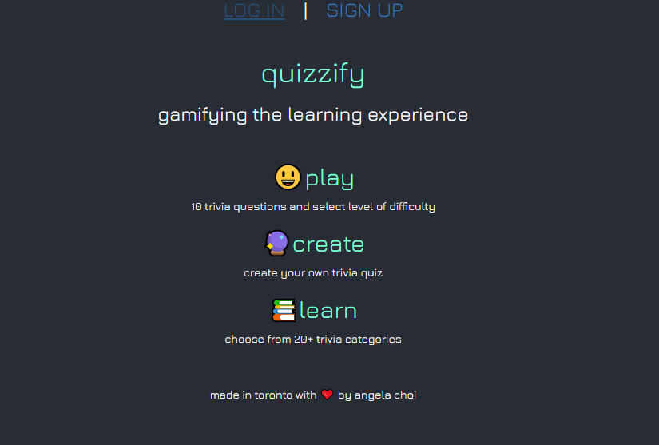
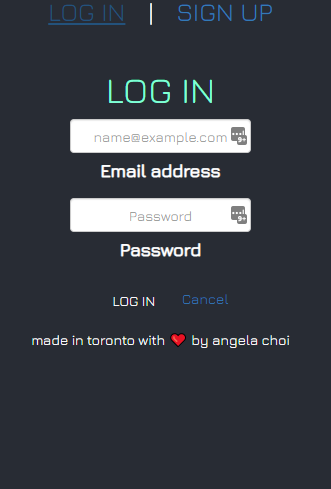
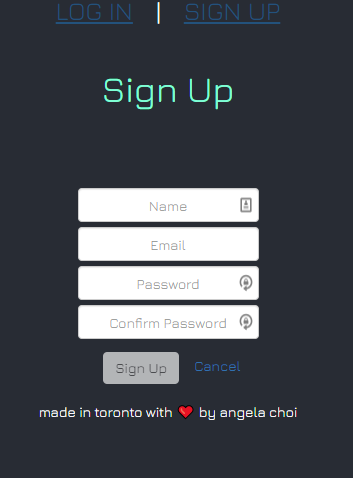
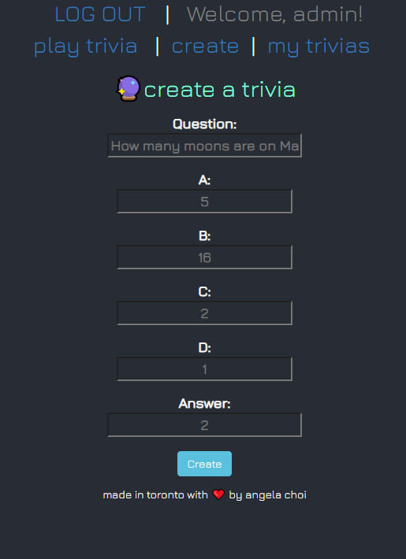
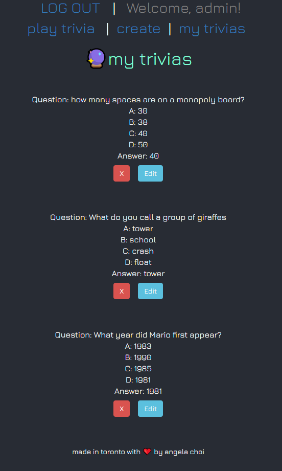
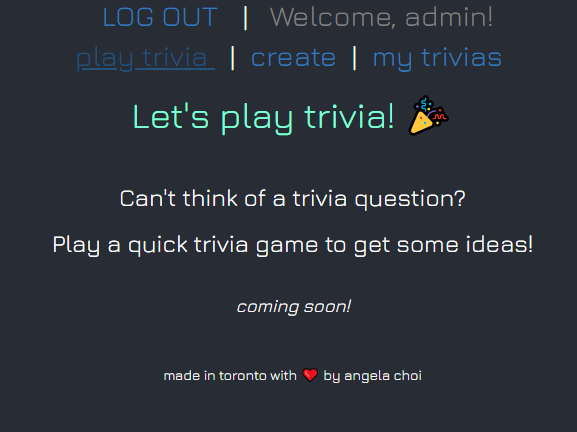

# 🔮quizzify
quizzify is a web application that allows you to add trivia questions and play trivia games to enhance your trivia gaming skills.

## Inspiration
I love learning, but if the learning experience is gamified, I will be able to retain the information longer and learn more. I wanted to create an application for people to continue to learn new things while having fun.

## Getting Started
Access the quizzify web app [here](https://quizzifyme.herokuapp.com/)

## Screenshots
Home page

| Log in | Signup |
| ---- | ------- |
| |     
  
Create a trivia

View all trivias

Play trivia

## Technologies Used
- React.js
- Node.js
- Express.js
- JavaScript
- CSS
- Bootstrap
- MongoDB
- Mongoose
- Token-based authentication
- AJAX
- RESTful routing
- Deployed on Heroku

## Planning Process

### 1️⃣ User Stories
The Trello board for user stories, product roadmap, and tasks can be found [here](https://trello.com/b/3Jbt30V1/quizzify).

### 2️⃣ Wireframes
Wireframes can be found [here](https://github.com/angelamchoi/react-trivia-game/tree/main/wireframe_pics)

## Reflection / Difficulties Faced

⛰️Difficulties Faced: 
- Routing

📚Lessons Learned:

- Utilizing Developer tools
    - React Inspector, `console.log`, Postman
- Deploy frequently
    - Every time I added a new feature I deployed and this helped me identify and fix issues

## Next Steps
The following are the next step in improving the application:

- Form validation
- Incorporate Trivia API under play games section
- Sort trivia questions
- Text to speech option
- Be able to favorite a trivia question
